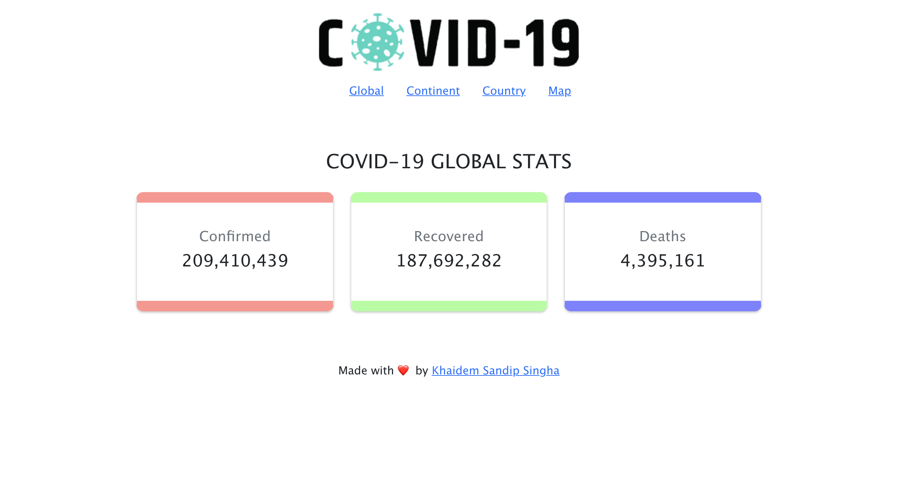
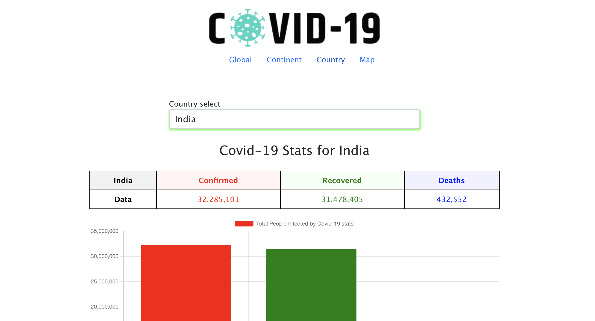

# COVID-19 MAP DASHBOARD

A covid-19 web app where you can view data on continents, countries and on Map. The data is presented in a line graph, a bar graph with selector input, and you can click on the Map to get statistics of that country. You also get the latest news on Covid on the news tab.

## Table of contents

- [Overview](#overview)
  - [Screenshot](#screenshot)
  - [Links](#links)
- [My process](#my-process)
  - [Built with](#built-with)
  - [What I learned](#what-i-learned)
  - [Useful resources](#useful-resources)
- [Author](#author)
- [Acknowledgments](#acknowledgments)

## Overview

It is a ReactJS Covid19 web app with multiples API endpoints generating global, continent, country, and news data. This data is representable visually on the front-end. News is generated from Guardian API.

### Screenshot

- Global page
  
- Continent page
  
- Country page
  
- Map
  
- News
  

### Links

- Live Site URL: [Live Website](https://kurosakicoder.github.io/Covid19MapStatistics/)

## My process

First, I had two to parse the API using the fetch function. And then, the data are presented visually using JSX and npm libraries on the front end.

### Built with

- JSX
- CSS
- React JS
- react-chartjs-2
- leaflet

### What I learned

I learned how to fetch multiple data using API endpoints.

```js
export const fetchDataChangeable = async (country) => {
  let changeableUrl = `${url2}/countries/India`;
  if (country) {
    changeableUrl = `${url2}/countries/${country}`;
  }
  try {
    const response = await axios.get(changeableUrl);
    const modifiedData = {
      confirmed: response.data.cases,
      recovered: response.data.recovered,
      deaths: response.data.deaths,
      todayCases: response.data.todayCases,
      country: response.data.country,
    };
    return modifiedData;
  } catch (error) {}
};
```

### Useful resources

- [Covid Disease document](https://disease.sh/docs/)

## Author

- LinkedIn - [Khaidem Sandip Singha ](https://www.linkedin.com/in/khaidemsandip/)
- Twitter - [@KurosakiCoder](https://twitter.com/KurosakiCoder)

## Acknowledgments

I have done this project from scratch by referencing the websites that I mentioned.
